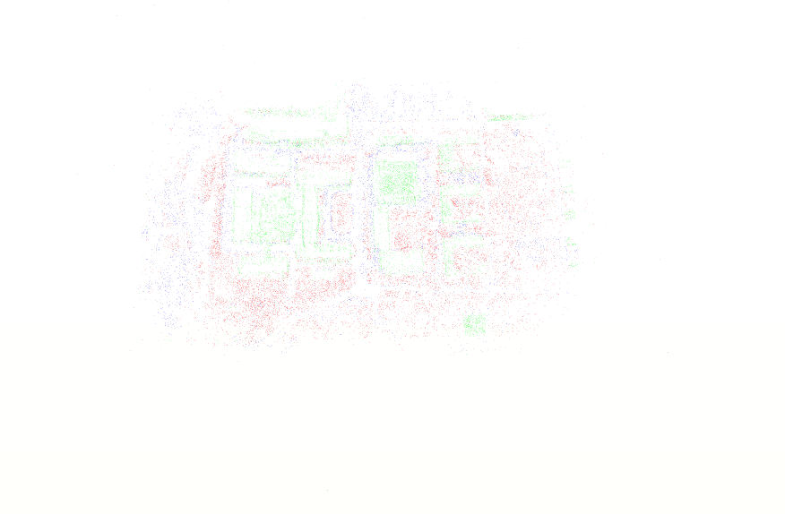

# SemanticSfM

This repository contains the reference code for sparse semantic reconstruction process based on the following paper: [**Large-Scale Structure from Motion with Semantic Constraints of Aerial Images**](https://link.springer.com/chapter/10.1007/978-3-030-03398-9_30)


The PDF of the article is available at this [link](https://link.springer.com/content/pdf/10.1007%2F978-3-030-03398-9_30.pdf).


## Abstract

Structure from Motion (SfM) and semantic segmentation are two branches of computer vision. However, few previous methods integrate the two branches together. SfM is limited by the precision of traditional feature detecting method, especially in complicated scenes. As the research field of semantic segmentation thrives, we could gain semantic information of high confidence in each specific task with little effort. By utilizing semantic segmentation information, our paper presents a new way to boost the accuracy of feature point matching. Besides, with the semantic constraints taken from the result of semantic segmentation, a new bundle adjustment method with equality constraint is proposed. By exploring the sparsity of equality constraint, it indicates that constrained bundle adjustment can be solved by Sequential Quadratic Programming (SQP) efficiently. The proposed approach achieves state of the art accuracy, and, by grouping the descriptors together by their semantic labels, the speed of putative matches is slightly boosted. Moreover, our approach demonstrates a potential of automatic labeling of semantic segmentation. In a nutshell, our work strongly verifies that SfM and semantic segmentation benefit from each other.



## Code Contribution

|Code Contributor|Contribution|
|---|---|
| Yu Chen(陈煜) |Structure from Motion|
| Yao Wang(王尧) |Semantic Segmentation|
|Xupu Wang(王旭普)|Data Visualization|

**Code for other usages are not allowed!**

## Code Map

```
$Root Directory
│
│─ README.md —— this file
│
|─ SemanticSfM —— structure from motion system
│  │
│  │─ do.sh  —— running script
│  │
│  │─ cmakeFindModules
│  │
│  │─ dependencies
│  │
│  │─ i23dSFM
│  │
│  │─ nonFree
│  │
│  │─ software
│  │
│  │─ testing
│  │
│  └─ third_party
│   
|─ testapp —— point cloud visualization by webGL
│  │
│  |─README.md —— user instruction of nodeJS
│  │
│  │─bin
│  │
│  │─public
│  │
│  │─routes
│  │
│  └─views
│   
└─ tensorpack —— semantic segmentation code
   │
   |─ README.md —— user instruction of tensorpack
   │
   │─ examples
   │  │
   │  └─ Deeplab
   │     │
   │     │─ metadata —— data path txt here
   │     │
   │     │─ PSSD
   │     │  │
   │     │  │- deeplabv2res101.pssd_train.py
   │     │  │
   │     │  │- deeplabv2res101.pssd_test.py
   │     │  │
   │     │  │- deeplabv2res101.pssd_val.py
   │     │  │
   │     │  ...
   │     ...
   ...
```
